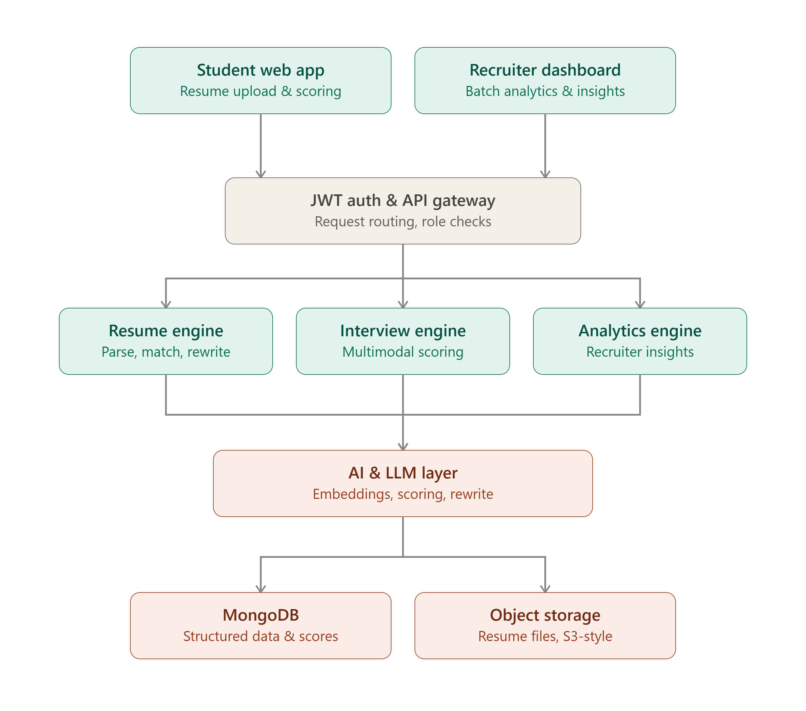
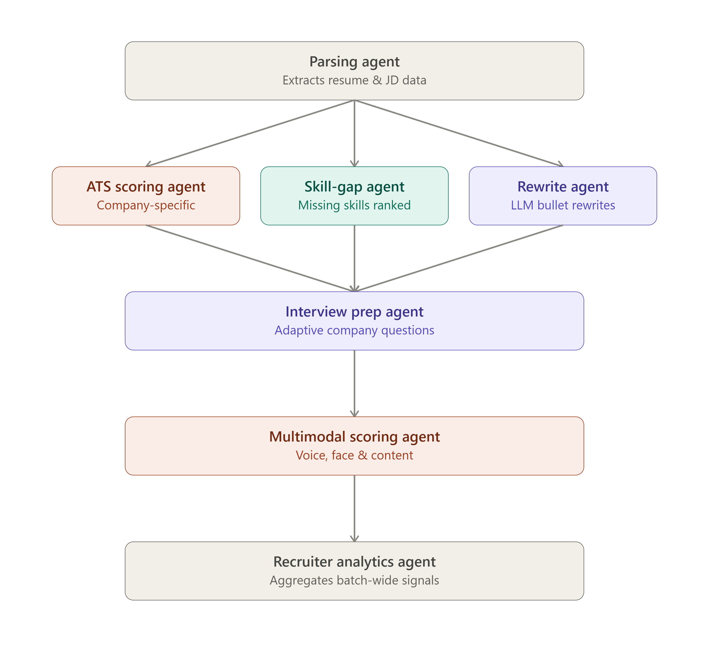

# 🎯 Personalized Interview Preparation System

Preparing for interviews can be overwhelming because every student has different strengths, weaknesses, and career goals. This project is designed to solve that problem by providing a personalized interview preparation experience powered by AI.

Instead of following a one-size-fits-all approach, the platform analyzes a student's profile, skills, and performance to create a customized learning journey and help them become placement-ready.

---

## 🏗️ System Architecture

The following diagram illustrates the high-level architecture of the Personalized Interview Preparation System, including the student application, recruiter dashboard, AI services, backend components, and data storage.



---

## 🤖 AI Agent Workflow

The platform uses multiple AI agents that collaborate to analyze resumes, identify skill gaps, generate personalized interview questions, evaluate candidate responses, and provide recruiter insights.



---

## ✨ Key Features

- 📄 AI-powered Resume Analysis
- 📊 ATS Resume Scoring
- 🤖 AI Mock Technical & HR Interviews
- 🎤 Voice-based Interview Practice
- 💻 Coding Practice (DSA)
- 📚 Personalized Learning Roadmap
- 🏢 Company-specific Interview Preparation
- 📈 Progress Tracking Dashboard
- 🧠 AI Feedback and Improvement Suggestions
- 🎯 Placement Readiness Score

---

## 🛠️ Tech Stack

### Frontend
- React
- TypeScript
- Tailwind CSS
- Vite

### Backend
- FastAPI
- Python

### Database
- MongoDB

### File Storage
- S3 Object Storage

### AI Technologies
- GPT
- Whisper (Speech-to-Text)

---

## 📂 Project Structure

```text
src/
 ├── components/
 ├── pages/
 ├── hooks/
 ├── services/
 ├── utils/

backend/
 ├── api/
 ├── models/
 ├── routes/
```

---

## 🎯 Project Goal

The goal of this project is to help students prepare for placements through an AI-powered, personalized learning experience. The platform identifies skill gaps, evaluates resumes, conducts mock interviews, recommends learning paths, and tracks user progress to improve interview readiness.

---

## 🚀 Current Status

This project is currently under active development.

### Planned Modules

- ✅ Resume Analyzer
- ✅ ATS Resume Scoring
- 🔄 AI Mock Interview
- 🔄 Coding Practice
- 🔄 Personalized Learning Roadmap
- 🔄 Progress Dashboard
- 🔄 Company-wise Interview Preparation
- 🔄 Recruiter Analytics Dashboard

---

## 💡 Future Enhancements

- AI Career Mentor
- Video Interview Analysis
- Emotion & Confidence Detection
- Personalized Learning Analytics
- Recruiter Dashboard
- Team Interview Simulation
- Placement Prediction
- Mobile Application

---

## 🤝 Contributing

Contributions, ideas, and suggestions are welcome. Feel free to fork this repository, open an issue, or submit a pull request.
